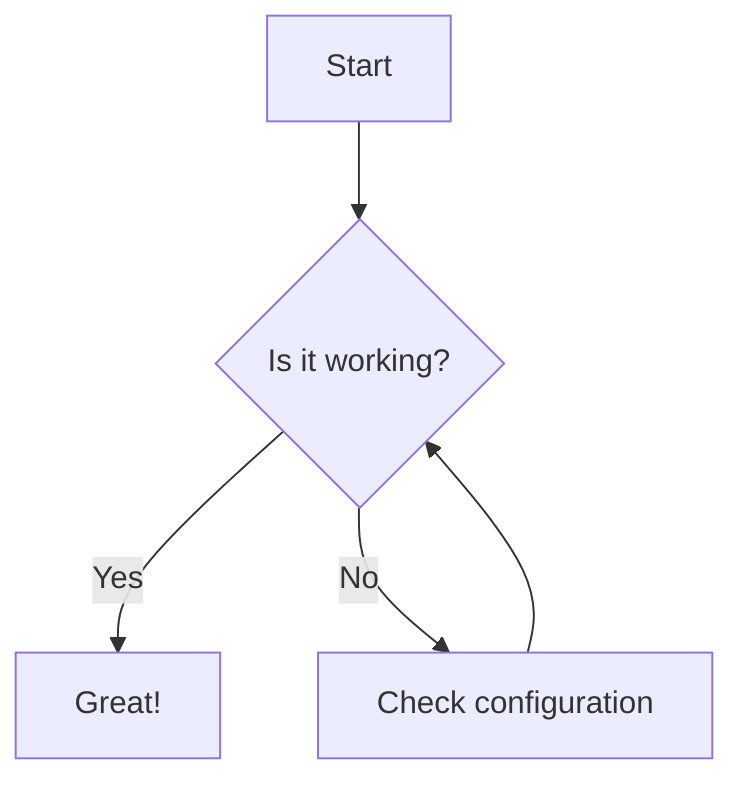

[TOC]
# 🧪 Markdown Previewer Benchmark

Ini adalah file pengujian komprehensif untuk memverifikasi kemampuan rendering `md-converter`.

---

## 1. Typography & Basic Styles
Anda bisa menulis teks dengan format **Tebal (Bold)**, *Miring (Italic)*, atau ***Keduanya***. 
Mendukung juga ~~Teks Coret (Strikethrough)~~ dan `Kode Inline`.

> **Blockquote Test:**
> "Design is not just what it looks like and feels like. Design is how it works."
> — *Steve Jobs*

---

## 2. GitHub Flavored Markdown (GFM)

### Task Lists
- [x] Implementasi React 19
- [x] Integrasi Tailwind CSS v4
- [ ] Implementasi Backend Python
- [ ] Pengujian End-to-End

### Tables
| Feature | Status | Technology |
| :--- | :---: | ---: |
| Markdown Parsing | ✅ | react-markdown |
| Syntax Highlighting | ✅ | prism |
| LaTeX Math | ✅ | katex |
| Docx Conversion | ⏳ | python-docx |

---

## 3. Code Highlighting (Syntax Highlighter)

### JavaScript
```javascript
function greet(name) {
  const message = `Hello, ${name}!`;
  console.log(message);
}

greet("Gemini CLI");
```

### Python
```python
class Converter:
    def __init__(self, source):
        self.source = source
        
    def convert(self):
        print(f"Converting {self.source} to Docx...")

app = Converter("test.md")
app.convert()
```

---

## 4. Mathematics (LaTeX)

### Inline Math
Rumus Pythagoras: $a^2 + b^2 = c^2$

### Block Math
$$
f(x) = \int_{-\infty}^{\infty} \hat{f}(\xi) e^{2 \pi i \xi x} d\xi
$$

---

## 5. Raw HTML Support
<div style="background-color: #0F3957; color: #E6E6E6; padding: 20px; border-radius: 10px; border: 1px solid #1B6498;">
    <h4 style="margin-top: 0; color: #FFFFFF;">HTML Rendering Test</h4>
    <p>Kotak ini di-render menggunakan tag <code>&lt;div&gt;</code> HTML mentah dengan inline CSS.</p>
    <ul style="color: #CCCCCC;">
        <li>Sanitasi tetap aktif</li>
        <li>Gaya inline diizinkan (jika dikonfigurasi)</li>
    </ul>
</div>

---

## 6. Complex Lists
1. Langkah Pertama
    - Sub-item A
    - Sub-item B
        1. Detail B.1
        2. Detail B.2
2. Langkah Kedua
3. Langkah Ketiga

---

## 7. Images & Links
[Kunjungi Repositori](https://github.com)


---

## 8. Mermaid Diagrams (Flowchart)


---
*End of Benchmark File*
